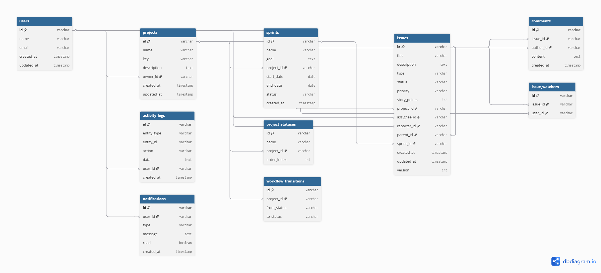

# PM Tool Backend

A Jira-like project management backend built with Spring Boot. It supports projects, issues, configurable workflow transitions, sprints, comments, notifications, activity history, issue watchers, search, and WebSocket updates.

## Key Features

- Issue Management (CRUD)
- Workflow Engine (Status Transitions)
- Sprint Management
- Comments & Activity Logs
- Search & Filtering
- Real-time updates (WebSocket)

## Tech Stack

- Java 17
- Spring Boot
- Spring Web / Data JPA / Validation / WebSocket
- Flyway
- MySQL for local development
- PostgreSQL-ready deployment path for Render

## System Architecture

The system follows a layered architecture:

Controller Layer
→ Handles HTTP requests and validation

Service Layer
→ Contains business logic (workflow rules, sprint handling, transitions)

Repository Layer
→ JPA repositories for database interaction

Database
→ MySQL (relational model with indexing)

Realtime Layer
→ WebSocket (STOMP) for broadcasting updates

Key design choices:
- Separation of concerns via layered architecture
- Stateless REST APIs
- Event-driven updates using WebSockets

## Database Design

Entities:
- User
- Project
- Issue (with hierarchy)
- Sprint
- Comment
- ActivityLog

## Database Schema (ERD)

 

## Local Setup

### Option 1: Run with Docker Compose

```bash
docker compose up --build
```

This starts:

- MySQL on `localhost:3306`
- API on `http://localhost:8080`

### Option 2: Run locally with Maven

1. Start MySQL and create a database named `pm_tool`
2. Keep these defaults or override with env vars:

```bash
SPRING_DATASOURCE_URL=jdbc:mysql://localhost:3306/pm_tool
SPRING_DATASOURCE_USERNAME=root
SPRING_DATASOURCE_PASSWORD=root
```

3. Start the app:

```bash
./mvnw spring-boot:run
```
### Option 3: API Documentation

Local Swagger:
http://localhost:8080/swagger-ui/index.html
Live Swagger:
https://pm-tool-49wx.onrender.com/swagger-ui/index.html

## Seed Data

The app seeds one demo user and one demo project on startup:

| Entity  | Value                                              |
| ------- | -------------------------------------------------- |
| User    | u1 / [harry@example.com](mailto:harry@example.com) |
| Project | p1 / PMT                                           |


## How To Test

### Health

```http
GET /health
```

### 1. Create a user

```http
POST /api/users
Content-Type: application/json

{
  "name": "Jane Smith",
  "email": "jane@example.com"
}
```

### 2. Create a project

```http
POST /api/projects
Content-Type: application/json

{
  "name": "Payments Platform",
  "key": "PAY",
  "description": "Project management workspace",
  "ownerId": "u1"
}
```

### 3. Create an issue

```http
POST /api/projects/p1/issues
Content-Type: application/json

{
  "type": "BUG",
  "title": "Login page bug",
  "description": "Submit button is not working",
  "priority": "HIGH",
  "storyPoints": 3,
  "reporterId": "u1",
  "assigneeId": "u1",
  "labels": ["auth", "backend"]
}
```

### 4. Get the board

```http
GET /api/projects/p1/board
```

### 5. Transition an issue

```http
POST /api/issues/{issueId}/transitions
Content-Type: application/json

{
  "userId": "u1",
  "toStatus": "In Progress"
}
```

Try moving directly from `To Do` to `Done` to verify workflow validation.

### 6. Create and start a sprint

```http
POST /api/projects/p1/sprints
Content-Type: application/json

{
  "name": "Sprint 10",
  "goal": "Ship auth fixes",
  "startDate": "2026-04-22",
  "endDate": "2026-05-05"
}
```

```http
POST /api/sprints/{sprintId}/start
```

### 7. Add a comment with a mention

```http
POST /api/issues/{issueId}/comments
Content-Type: application/json

{
  "authorId": "u1",
  "content": "Please take a look @harry@example.com"
}
```

### 8. Search issues

```http
GET /api/search?q=login&projectId=p1&status=In Progress&priority=HIGH
```

### 9. Notifications

```http
GET /api/notifications?userId=u1
```

### 10. Presence

```http
POST /api/presence/p1/join?userId=u1
GET /api/presence/p1
POST /api/presence/p1/leave?userId=u1
```

### 11. WebSocket subscriptions

Connect a STOMP client to:

- `ws://localhost:8080/ws`

Subscribe to:

- `/topic/projects/p1`
- `/topic/issues/{issueId}`
- `/topic/projects/p1/presence`

Event types emitted include:

- `issue_created`
- `issue_updated`
- `issue_moved`
- `comment_added`
- `sprint_updated`

## Testing

```bash
./mvnw test
```

## Architecture Notes

- `ProjectStatus` and `WorkflowTransition` make workflow rules configurable per project.
- `@Version` on the base entity enables optimistic locking for concurrent updates.
- `ActivityLog` stores the audit trail for issue and sprint mutations.
- `Notification` supports in-app assignment/mention/status events.
- WebSocket broadcasting is centralized in `RealtimeEventPublisher`.
- Search currently uses JPA specifications over relational fields and text fields.

## Current Trade-offs

- Custom fields are modeled in the schema and entities, but there is no CRUD API for them yet.
- Missed-event replay is not fully implemented; current real-time support focuses on live broadcasts and presence snapshots.
- Search is relational and text-based, not a dedicated search engine.

## Deployment
- Hosted on Render
- Uses environment-based configuration
- PostgreSQL-compatible setup
